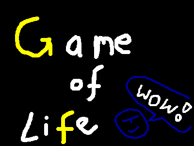
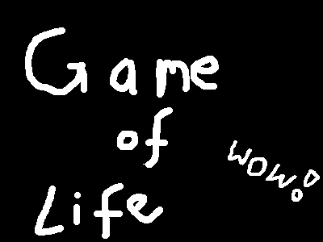

# Game of Life
Simple implementation of Conway's Game of Life in pure C++ as an exercise.

1. Take input image  

2. Run `./build/gameoflife initialState.png`
3. This generates an output animation  

## Requirements
- C++ (e.g. g++)
- CMake
- ImageMagick and FFmpeg (optional, for converting input/output)
